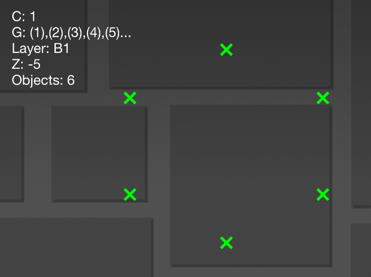

# Project: Selector Panel

Let's put everything we have learned into use!

When creating things other than levels in Geometry Dash, one of the biggest challenges is _controls_. Since there are only 2 buttons to use, it is often hard to make your creation easy to understand for players.

One of the most common solutions to this is making a _selector panel_, where you use one button to choose an action, and the other to perform the action.

## Setting up the editor

You could technically do this all in SPWN, but when making the graphical bits, it's often more useful to visually see what we're doing. Therefore, we will do some setup in the gd level editor before we apply a SPWN script on it.

First off, we need to decide where our buttons should be. To do this, we're going to place some objects (with one group each) in a pattern of our choosing. I chose a hexagon (because hexagons are the bestagons). Make sure to add group 1 to object 1, group 2 to object 2 and so on until you've used groups 1 - 6.



Next up, we need some kind of graphical element to show which button is currently selected. To do this, I just used a circle, but you can get as creative as you like. Remember to add group 7 to the selector

**Here's my final setup:**


**For this to work, each component (buttons, selector) needs to contain _only 1 object_, and each group-ID must be used only once. Make 100% sure that this is true before continuing.**

## Writing the program

Ok, let's write an actual SPWN program!

First things first, let's take the groups we assigned to the objects we already placed in the level, and store them in variables. Let's start with the objects we placed first, which were the ones that decided the position of our buttons. I'm going to call them _anchors_ from now on. Let's also store them in an array, in case we want to add more buttons later.

```spwn
// Groups of the objects that decide the position of
// our buttons
anchors = [1g, 2g, 3g, 4g, 5g, 6g]

// Group of the object that indicates which
// button is currently selected
selector = 7g
```

Next up, we need to get input from our user. As many who has tried making something with Geometry Dash triggers before knows, managing input in Geometry Dash can be very frustrating. Luckily, there is a library that comes with SPWN that makes it super simple, so you don't have to think about it at all. This library is called _gamescene_, and includes some features which are very useful for making controls. Let's import it using an `import` expression:

```spwn
gs = import gamescene
```

Now we can have some code run when we click one of the buttons. I'm going to choose the left button for switching, and the right side for activating. Since we will only be covering the switching of buttons in this mini-project, we will only use the left button, which is `button_a`:

```spwn
on(gs.button_a(), !{
    // switch
})
```

Let's add a variable to keep track of what button is currently selected. For this, we will use a counter.

```spwn
// starts at first button (index 0)
selected = counter(0)

on(gs.button_a(), !{
    // switch
})
```

> **Note:** It might feel more intuitive to make a mutable variable with `let`, instead of a counter. However, this will not work, as you will see if you try it out...

Ok, let's make the button switch inside the function we just created. Here's what it needs to do:

- 1: Increment the `selected` variable

```spwn
selected += 1
```

- 2: Check if the `selected` variable value has reached the last button, and if so, reset it back to 0.

```spwn
if selected >= anchors.length {
    selected = 0
}
```

- 3: Move the selector to the right anchor

```spwn
current_anchor = anchors[selected]
selector.move_to(current_anchor)
```

Here's what we have so far:

```spwn
// Groups of the objects that decide the position of
// our buttons
anchors = [1g, 2g, 3g, 4g, 5g, 6g]

// Group of the object(s) that indicate which
// button is currently selected
selector = 7g

gs = import gamescene

// starts at first button (index 0)
selected = counter(0)

on(gs.button_a(), !{
    // switch
    selected += 1
    if selected >= anchors.length {
        selected = 0
    }
    current_anchor = anchors[selected]
    selector.move_to(current_anchor)
})
```

However, if we try to run this, it will throw an error:

```error
Error: Type mismatch
    ╭─[test\test.spwn:21:22]
    │
 12 │ selected = counter(0)
    · ──────────┬──────────
    ·           ╰──────────── 1: Value defined as counter here
 21 │     current_anchor = anchors[selected]
    ·                      ────────┬────────
    ·                              ╰────────── 2: Expected number, found counter
────╯
```

SPWN needs the index to be a normal number, not a counter! Luckily, since we know our `selected` counter will only be a value from 0 up to (and not including) the number of buttons, we can convert it to a normal number using the `.to_const` macro:

```spwn
current_anchor = anchors[
    selected.to_const(0..anchors.length)
]
```

**Here is the final product:**

```spwn
// Groups of the objects that decide the position of
// our buttons
anchors = [1g, 2g, 3g, 4g, 5g, 6g]

// Group of the object that indicates which
// button is currently selected
selector = 7g

gs = import gamescene

// starts at first button (index 0)
selected = counter(0)

on(gs.button_a(), !{
    // switch
    selected += 1
    if selected >= anchors.length {
        selected = 0
    }
    current_anchor = anchors[
        // convert selected to a normal number
        selected.to_const(0..anchors.length)
    ]
    selector.move_to(current_anchor)
})
```

[**Next Chapter**](scriptassistedbuilding/script_assisted_building.md)
